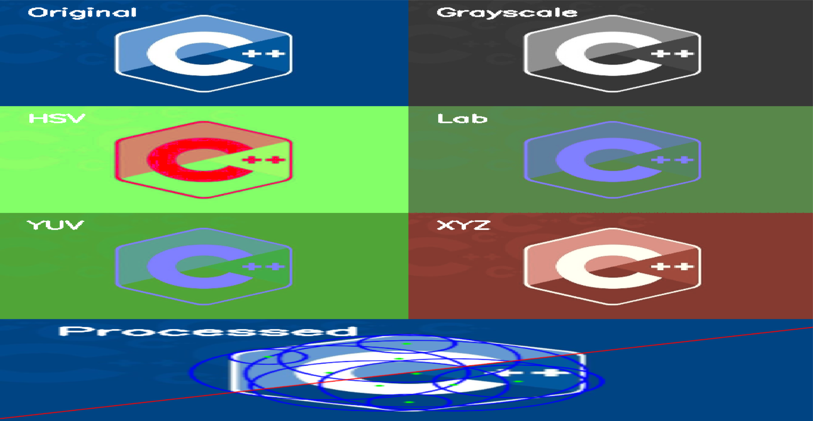

# Обработка изображений с OpenCV: изменение цвета, обнаружение окружностей,линий.
## Описание
1. **Загрузка изображения**:  

2. **Преобразование в оттенки серого**:  
   Исходное изображение преобразуется в градации серого с помощью функции `cv::cvtColor`.

3. **Размытие Гаусса**:  
   К изображению применяется размытие Гаусса для уменьшения шума с помощью функции `cv::GaussianBlur`.

4. **Обнаружение кругов**:  
   Используется метод Хафа (`cv::HoughCircles`) для обнаружения кругов на изображении. Обнаруженные круги отрисовываются на изображении.

5. **Обнаружение линий**:  
   Используется метод Хафа (`cv::HoughLines`) для обнаружения линий на изображении. Обнаруженные линии отрисовываются на изображении.

6. **Преобразование в различные цветовые пространства**:  
   Исходное изображение преобразуется в следующие цветовые пространства:
   - HSV (`cv::COLOR_BGR2HSV`)
   - Lab (`cv::COLOR_BGR2Lab`)
   - YUV (`cv::COLOR_BGR2YUV`)
   - XYZ (`cv::COLOR_BGR2XYZ`)

7. **Отображение результатов**:  
   Все этапы обработки (исходное изображение, обработанное изображение, градации серого, HSV, Lab, YUV, XYZ) отображаются в виде сетки изображений с помощью функций `cv::hconcat` и `cv::vconcat`.

8. **Вывод результатов**:  
   Итоговая сетка изображений отображается в окне с помощью `cv::imshow`.

### Результат:

